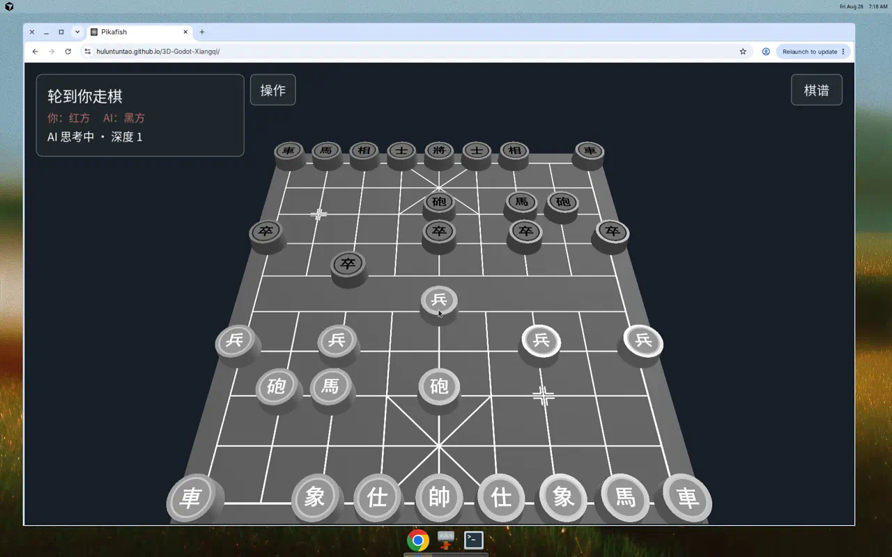

<div align="center">
  
  <h1>3D Godot 象棋</h1>
  <p>基于GDS和compute shader的类Pikafish中国象棋推理引擎及示例游戏</p>
</div>

仅是一个实验性项目

推理引擎大量参考了 [Pikafish](https://github.com/official-pikafish/Pikafish) 的代码 ，并使用 Godot 重新实现

但具体逻辑与Pikafish之间仍存在差异，并非严格对齐

由于象棋推理在用户设备上优先使用GPU运行计算着色器运行，失败时fallback到CPU运行GDS，因此性能与用户设备存在很大的关系

对于硬件配置欠缺的设备，会有明显的卡顿问题

浏览器可直接打开 [GitHub Pages 试玩](https://huluntuntao.github.io/3D-Godot-Xiangqi/)。

目前提供：
- 可玩的 3D 象棋版本
- 可嵌入的推理引擎 godot addon

| 你想… | 从这里开始 |
|---|---|
| 浏览器打开就能下 | [浏览器试玩](#浏览器试玩) |
| 打开就能下 | [下棋](#下棋) |
| 嵌进自己的 Godot 项目 | [当引擎用](#当引擎用) |
| 生成权重、跑测试、看性能 | [开发与复现](#开发与复现) |

需要 **Godot 4.7.1**（Mobile renderer）。把下面命令里的 `godot` 换成你的可执行文件即可。

## 浏览器试玩

GitHub Pages：[https://huluntuntao.github.io/3D-Godot-Xiangqi/](https://huluntuntao.github.io/3D-Godot-Xiangqi/)

将在进入游戏后自动下载模型权重（约52MB），权重文件来自Pikafish官方仓库。浏览器会把解压后的权重缓存在本地，再次打开一般不用重新下载；iPhone 上把页面添加到主屏幕后，缓存更不容易被清掉。



## 下棋

主场景已经是对局界面（`res://src/game/main.tscn`）。用编辑器打开本仓库，按运行。

第一次克隆后，**`data/` 不在 git 里**。没有权重时引擎会初始化失败，先按 [准备权重](#准备权重) 生成 `data/`，再打开项目。

对局里可以选红/黑/随机、限时和引擎思考时间，也可以悔棋、翻面、认输。

## 当引擎用

对局 UI 只在宿主仓库里。要嵌进别的项目，拷贝 `addons/pikafish/`，再自备权重（见下）。公开 API 是 `PikafishEngine`：

```gdscript
var engine := PikafishEngine.new()
assert(engine.initialize() == OK)
engine.set_fen("rnbakabnr/9/1c5c1/p1p1p1p1p/9/9/P1P1P1P1P/1C5C1/9/RNBAKABNR w - - 0 1")
engine.start_search({"movetime_ms": 1200})
```

初始化、走子、异步搜索和导出打包说明见 [addons/pikafish/README.md](addons/pikafish/README.md)。头烟测试：

```bash
godot --headless --path . -s res://tools/smoke_addon_headless.gd
```

期望输出 `SMOKE_PASS`。

## 准备权重

对局和 addon 都从 `res://data`（或 `res://addons/pikafish/data`）读 `manifest.json` 与 `.bin` 权重，约 70 MB，**不入 git**。浏览器试玩不需要这一步，权重由 Pages 侧载，见 [浏览器试玩](#浏览器试玩)。

只需官方 `pikafish.nnue` 和 Python 3：

```bash
python3 tools/parse_nnue.py /path/to/pikafish.nnue
python3 tools/gen_tables.py
```

有编译好的 Pikafish 二进制时，可再生成测试用的 oracle 参考（下棋不需要这一步）：

```bash
python3 tools/gen_reference.py --oracle /path/to/pikafish --net /path/to/pikafish.nnue
```

## 开发与复现

```bash
# 回归（GUT）
godot --headless --path . -s addons/gut/gut_cmdln.gd -gdir=res://src/test/gut -gexit

# GPU / CPU 推理对 oracle
godot --headless --path . -s res://src/test/run_gpu_test.gd

# 性能基准（窗口）
godot --path . -s res://src/test/bench_gpu.gd
```

NNUE 与 oracle 的对齐记录、M1 Pro 上的测时见 [docs/perf-log.md](docs/perf-log.md)。真机仪表盘见 [docs/device-test-dashboard.md](docs/device-test-dashboard.md)。

本仓库**不是** UCI 命令行引擎；协议仍以 [Pikafish Wiki](https://github.com/official-pikafish/Pikafish/wiki/UCI-&-Commands) 为准。移植对照见 [docs/upstream-map.md](docs/upstream-map.md)。

```
src/game/                 3D 对局（棋盘、HUD、人机）
addons/pikafish/          引擎 addon（局面 / 着法 / 搜索 / NNUE / shaders）
src/test/                 GUT 与 headless 复现脚本
tools/                    解析 nnue、生成特征表与参考数据
data/                     权重块（不入 git）
docs/                     性能、真机与上游对照
```

## 许可

许可对齐 [Pikafish](https://github.com/official-pikafish/Pikafish)：引擎源码 GPL v3；网络训练数据 / `.nnue` 相关 ODbL。

### GNU GPL v3

`src/`、`addons/pikafish/`（第三方插件除外）和 `tools/` 以 [GNU GPL v3](Copying.txt) 发布。可以自由使用、修改、再分发（包括商用），但分发本程序或其衍生作品时必须同时提供 GPL v3 许可与对应源码；修改也必须以 GPL v3 提供。

上游：[Pikafish](https://github.com/official-pikafish/Pikafish)、[Stockfish](https://github.com/official-stockfish/Stockfish)。

### 神经网络权重（`.nnue` / `data/`）

`pikafish.nnue` 及 `tools/parse_nnue.py` 解出的权重块来自 Pikafish 发布的网络。训练数据来自 [Pika Xiangqi Zero](https://www.kaggle.com/datasets/pikacat/px0data)，以 [ODbL](https://opendatacommons.org/licenses/odbl/odbl-10.txt) 提供。再分发或基于该网络做衍生数据库时请遵守 ODbL。

### 第三方

| 组件 | 许可 | 说明 |
|---|---|---|
| [GUT](addons/gut/) | MIT | 测试框架，见 `addons/gut/LICENSE.md` |
| Godot Engine | 其自身许可 | 本仓库不附带引擎二进制 |
